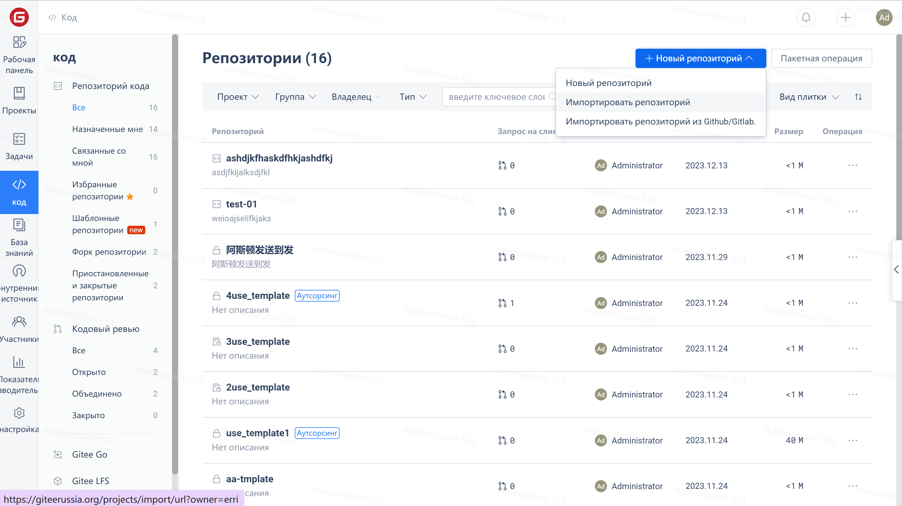
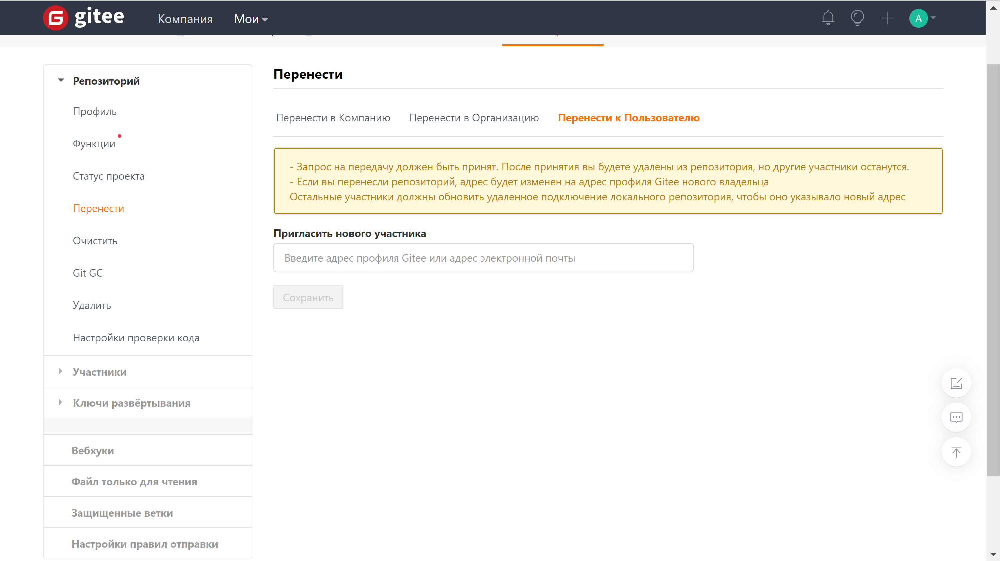

Вы можете переносить репозитории из индивидуальных учетных записей в корпоративные с помощью кодов переноса.

1. Нажмите "Проекты"->"Новый репозиторий"->"Перенести репозиторий" на панели управления предприятия:

2. Нажмите "Сгенерировать код переноса" и скопируйте сгенерированный код переноса

3. Перейдите в раздел "Управление"-"Перенос репозитория" репозитория, который вы хотите перенести на предприятие, вставьте код переноса и подтвердите его

