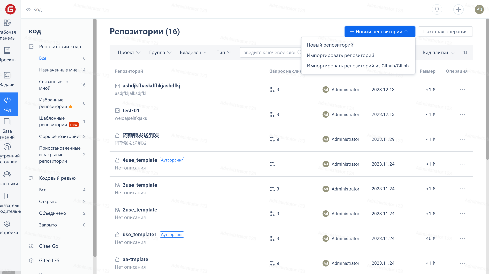
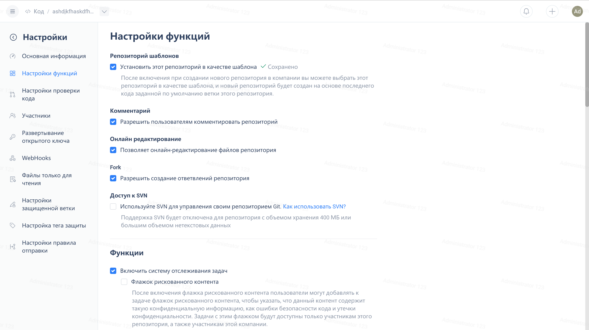
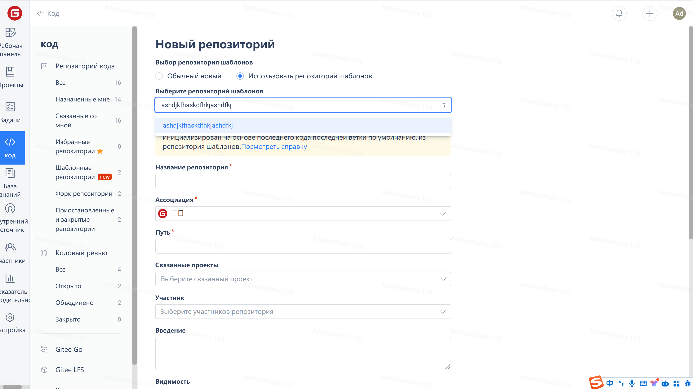
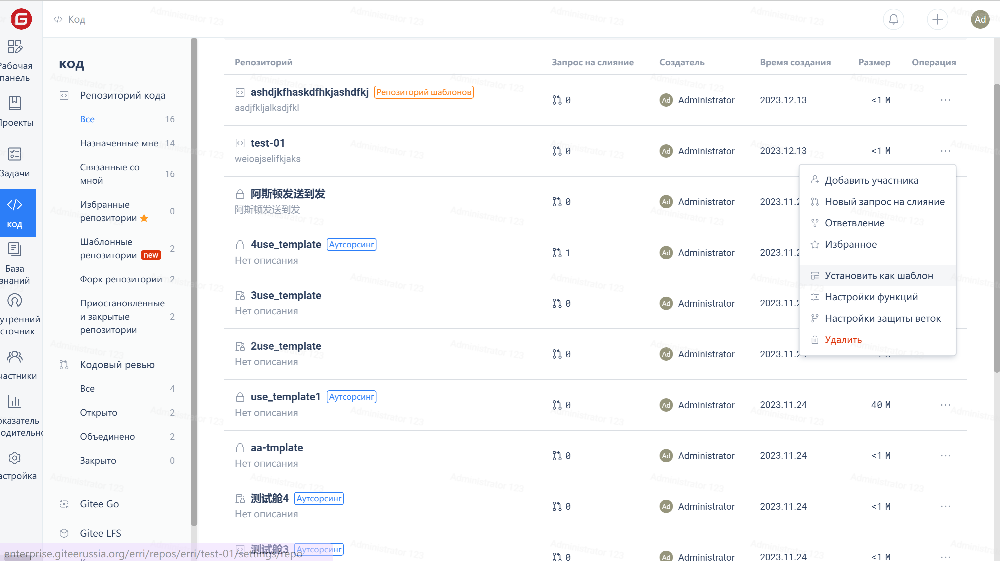
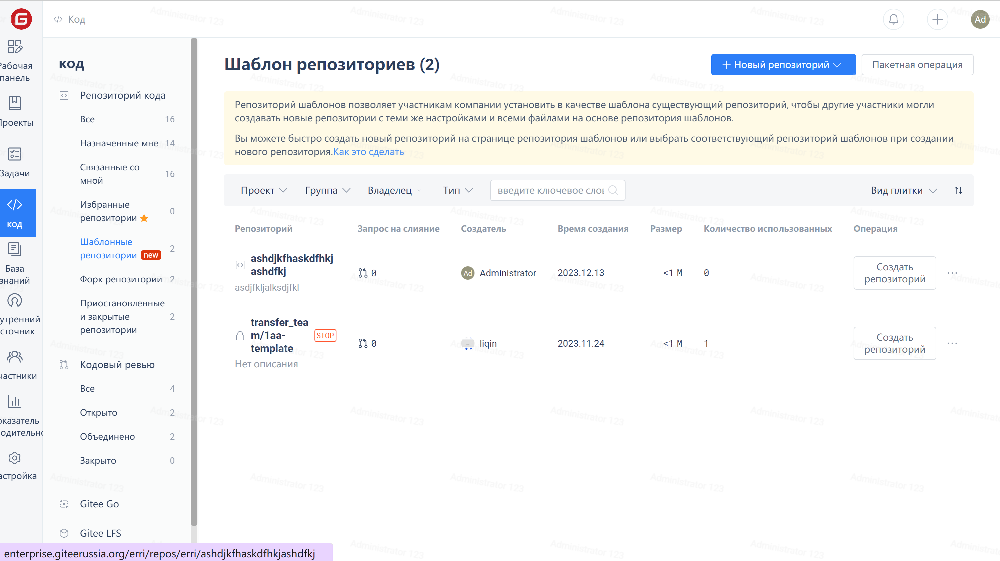
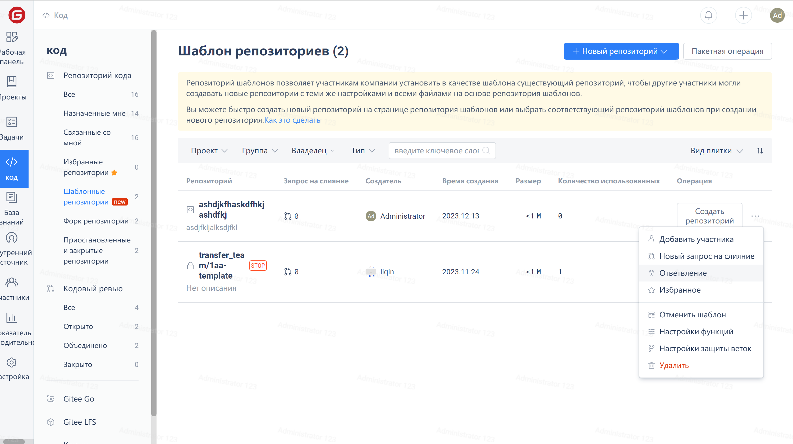

Введение функции:

Репозиторий шаблонов: Позволяет участникам предприятия устанавливать существующие репозитории в качестве шаблонов, чтобы другие участники могли создавать новые репозитории с тем же кодом на основе шаблона репозитория.
Вы можете быстро создать новый репозиторий на странице репозитория шаблонов или выбрать соответствующий репозиторий шаблонов при создании нового репозитория.

Инструкции по работе:

1. Описание разрешения: Войти в систему в качестве администратора репозитория или администратора предприятия и установить репозиторий в качестве шаблона репозитория.

2. Шаги по созданию шаблона репозитория:

(1) Войдите в учетную запись Gitee и войдите в рабочую область предприятия. Выберите "Код" и нажмите "Новый репозиторий". Заполните полную информацию о репозитории и нажмите "Создать", чтобы продолжить.

(2) После создания репозитория нажмите Репозиторий -> Управление -> Настройки функций -> Проверить репозиторий шаблонов, чтобы выбрать его, чтобы репозиторий стал 'репозиторий шаблонов'.

(3) При повторном создании нового репозитория вы можете использовать шаблонный репозиторий для быстрого использования. Нажмите на Новый репозиторий -> Использовать репозиторий шаблонов и выберите нужный шаблонный репозиторий -> Создать успешно.

 **Примечание: Если вы хотите установить существующий репозиторий в качестве репозитория шаблонов, просто перейдите к настройкам репозитория, как показано ниже:**.

3. Как просмотреть существующие репозитории шаблонов?

   Нажмите на Код -> Репозиторий кода -> Репозиторий шаблонов для просмотра.

4. Как отменить репозиторий шаблонов?

Нажмите на Код -> Репозиторий кода -> Репозиторий шаблонов -> Нажмите правой кнопкой мыши 'Отменить репозиторий шаблонов'

