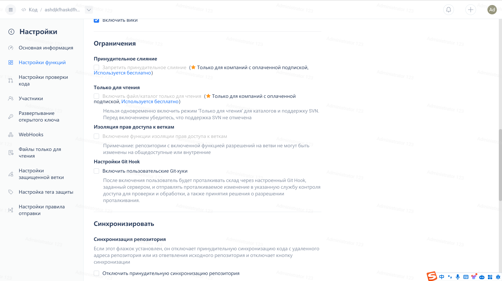

Git has a scary feature called -f parameter, which is force push. It forcefully overrides the remote repository with the local repository. The consequences include the possibility of files being overwritten with older content and the loss of commit history.

Forced push usually occurs when there are conflicts in the repository version. In collaborative development, many developers, in order to save trouble, directly use the -f push, and then the tragedy happens.

The normal process is to find a way to resolve conflicts and then push.

Gitee Enterprise customers have launched the function of restricting forced pushes to repositories. From the repository management page, you can select 'Disable Force Push'.

Once the forced push is disabled, if a developer uses the -f parameter during a push conflict, the following error will be reported:

`denying non-fast-forward refs/heads/master (you should pull first)`

This feature is currently only available to enterprise customers and is not enabled by default. It needs to be manually enabled.

Of course, we recommend using fork + pull requests for collaborative development, or setting the main branch as read-only and then using

-----------------

Go to experience Gitee Enterprise now: [https://gitee.ru/enterprises](https://gitee.ru/enterprises)