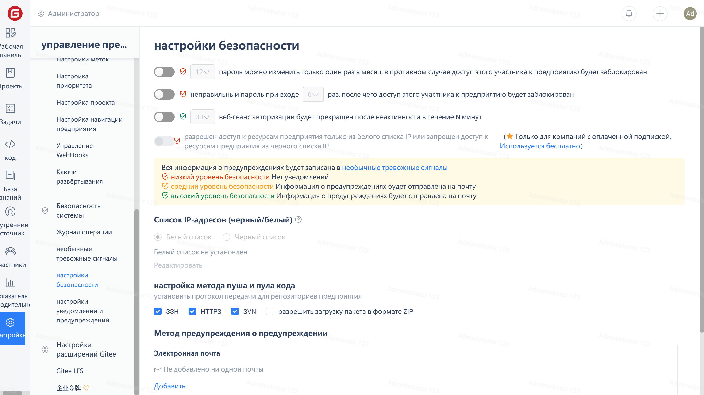

In some development environments and security control scenarios within enterprises, there are certain restrictions on the repository's download methods.

Based on this demand scenario, Gitee Enterprise Edition introduces security settings for the operation methods of internal public repositories and private repositories, allowing enterprises to set how internal public repositories and private repositories can be accessed.

Enterprise administrators can click on 'Security Settings' - 'Push/Pull Code Settings' in the enterprise 'Management' interface to set it. The checked item indicates that code Push/Pull operations are allowed in this way.

The above settings only allow SSH-based push/pull operations for public and private repositories within the enterprise. If a user tries to operate via HTTPS or SVN, they will see the following prompt:

> Pull/Push via HTTPS is forbidden due to enterprise's security setting, more details at <http://git.mydoc.io/?t=307581>

If you encounter similar prompts during operation, please contact the enterprise administrator to check the security settings and confirm the allowed operation methods. Perform operations through the specified methods designated by the enterprise.