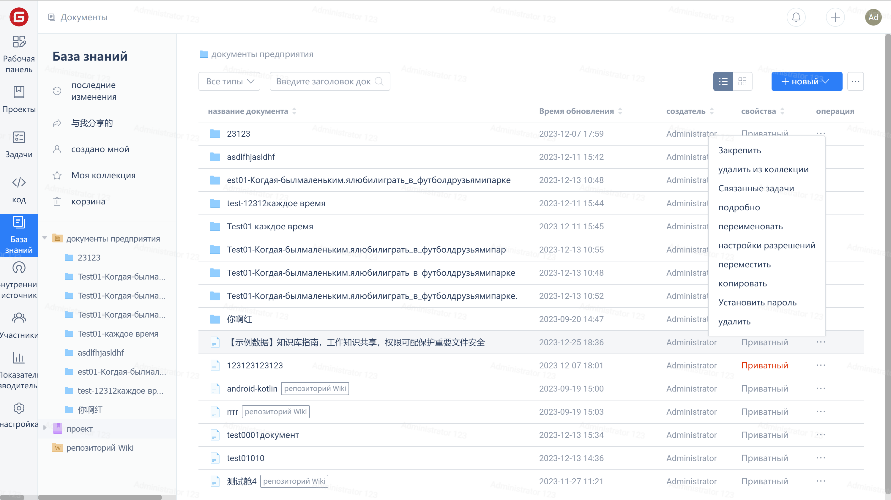
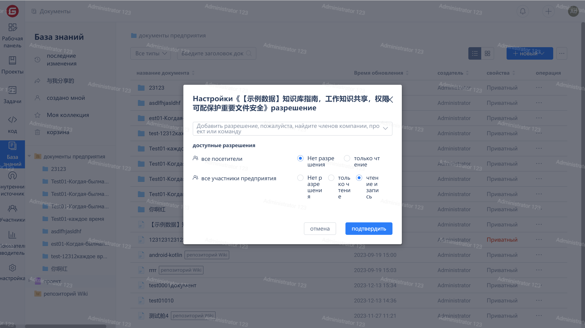

Вы можете самостоятельно настраивать разрешения доступа участников на основе ролей, папок и документов: "Нет доступа", "Только чтение", "Чтение и запись", чтобы помочь менеджерам защитить интеллектуальную собственность и снизить риск утечки кода.

