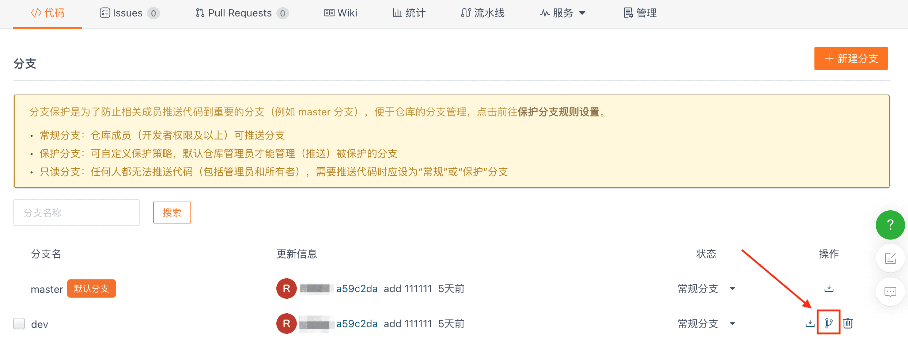
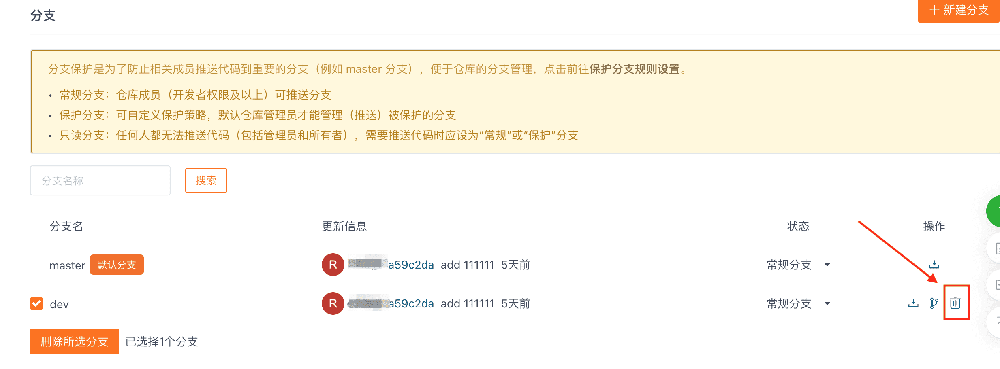

## Установка ветки по умолчанию для репозитория

После нажатия на кнопку "Ветки" в левом верхнем углу главной страницы репозитория вы увидите все существующие ветви репозитория. Ветка по умолчанию будет отмечена оранжевым значком рядом с названием ветки по умолчанию. В правом столбце действий для веток, не являющихся ветками по умолчанию, нажав на значок ветки ниже, вы можете изменить ветку, не являющуюся веткой по умолчанию, на ветку по умолчанию.

## Удаление ветки

В репозитории можно удалять только ветки, не входящие в число веток по умолчанию. Чтобы удалить ветку, не входящую в число веток по умолчанию, нажмите на значок корзины в правой колонке действий ветки.

