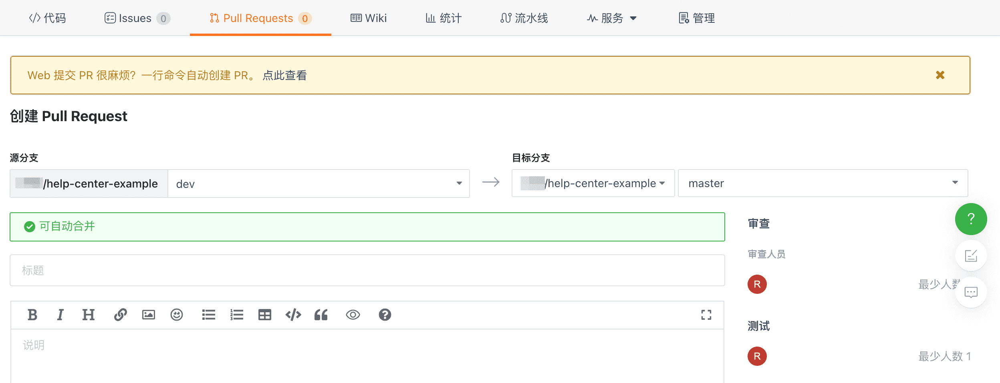
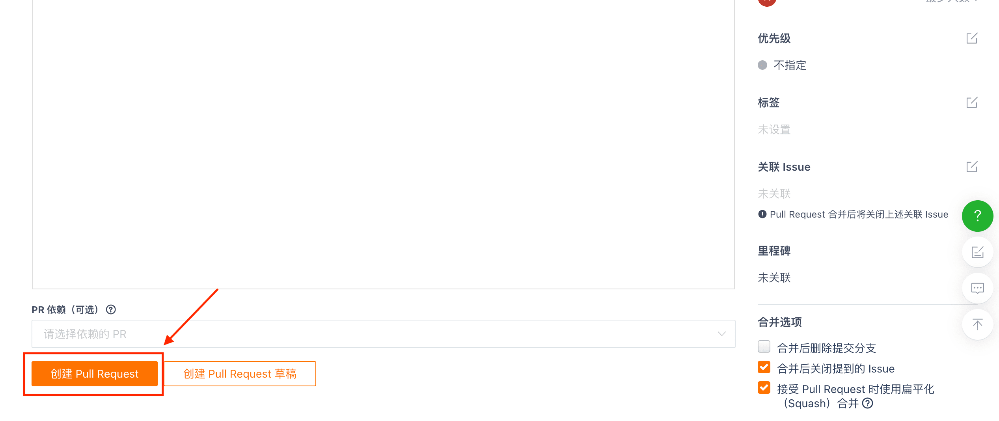

## How to merge branches?

Step 1: Switch to the branch you want to merge in the repository main interface. You will receive a prompt indicating the number of commits that are different from the upstream branch (Note: merging can only be done when there are differences between the two branches). If you want to merge this branch into its upstream branch, click the 'Contribute code' button next to the prompt and then click 'Create Pull Request' in the dropdown menu.

**Step 2:** After entering the Pull Request interface, select the `source branch` and `target branch` for the merge. You can also add `labels`, `descriptions`, and `PR dependencies` for this Pull Request. In the `merge options` at the bottom right, select the desired merge method, and then click `Create Pull Request` to submit the PR.

**Step 3:** After successfully creating a Pull Request, you can find the PR you submitted on the repository's Pull Request page. Once it has been reviewed and tested successfully, the branch can be successfully merged.

