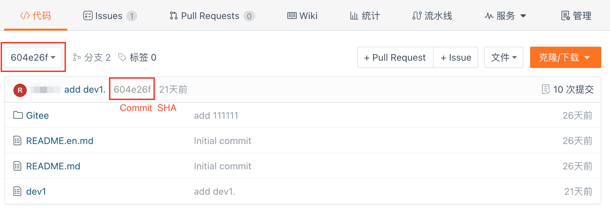
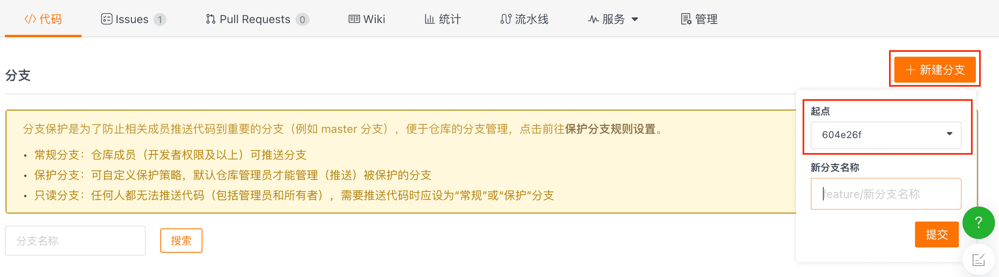

Можно ли восстановить удаленные ветки?

Даже если ветка удалена, у нас есть для вас хорошие новости! Да, можно!
Следуйте приведенным ниже инструкциям, которые помогут вам возродить удаленную ветку!

Восстановление коммитов из удаленных веток

После удаления ветки на главной странице репозитория в правом нижнем углу вы можете увидеть подсказку о недавней активности для операции удаления ветки.

Нажмите по удаленной ветке в этом действии, и вы сможете найти Commit SHA последней фиксации на странице.

## Перестроить удалённую ветку

Скопируйте найденный Commit SHA и нажмите кнопку "Создать новую ветку" на странице ветки репозитория. Введите Commit SHA в поле 'Отправная точка' в выпадающем меню, добавьте новое имя ветки и отправьте, чтобы завершить восстановление удаленной ветки.

