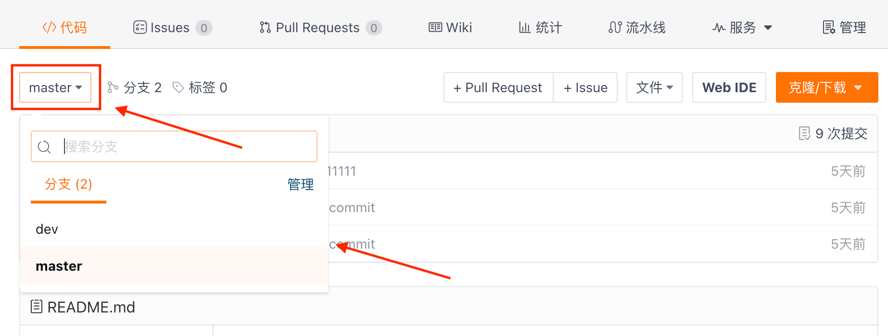
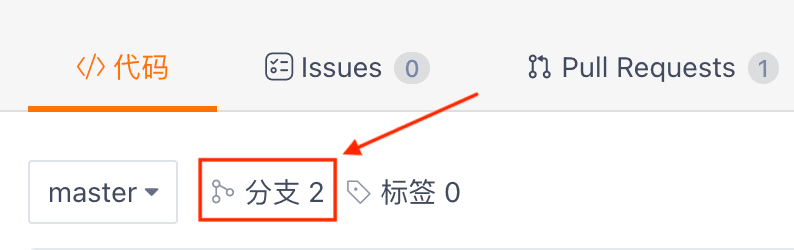
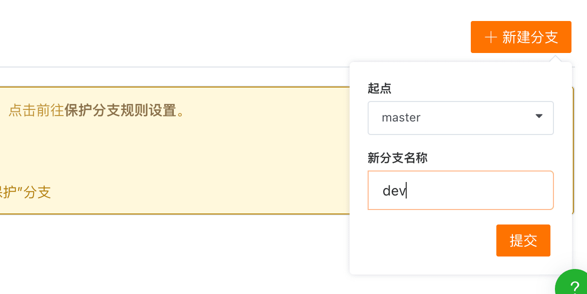

## Filter and view different branches in the repository

Click on your repository to enter. The default branch you are currently on will be displayed in the upper left corner of the repository main page. Click to open the dropdown menu and switch to any branch of the repository to view.

## Create a New Branch

Click on your repository, click on the 'Branches' button on the top left of the repository main page to enter the branches page. Here, you can see the existing branches of the repository along with their update information and status. You can also perform a series of quick operations on branches. For example, by clicking the '+ New Branch' button on the top right of this page, you can create a new branch.

