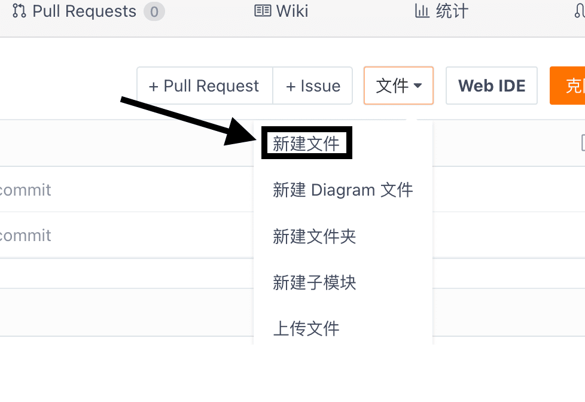
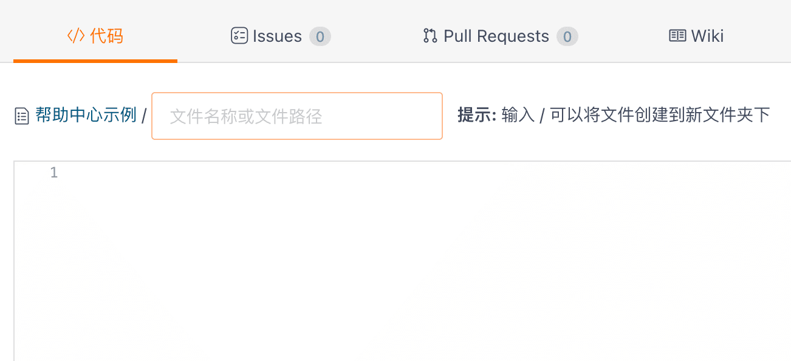
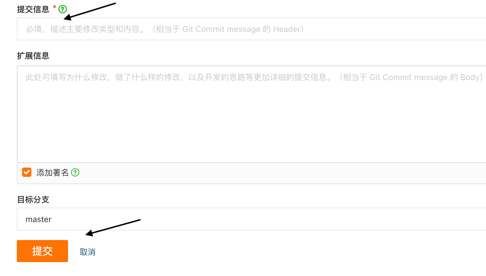
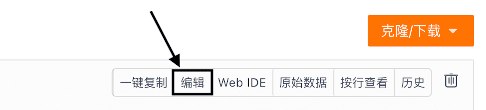
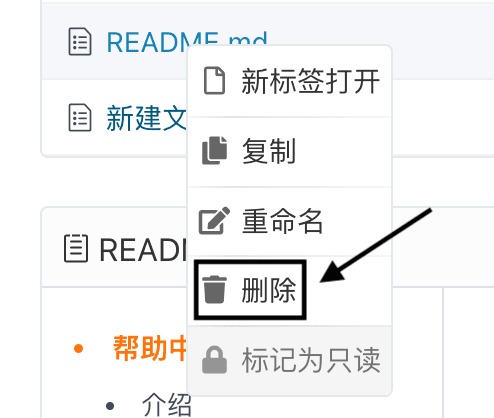

## Create a new file or folder online

Click into your repository, pull down the 'Files' menu, select the 'New file' function. Fill in the file name or file path, write the document content, add your commit message, and then 'Commit'.

Online file updates

To update the file, click on 'Edit' on the right side of the page. After making the desired changes and adding the commit information, select 'Commit'.

## Delete Files Online

Select the file or folder to be deleted, right-click, and choose the "Delete" function.

