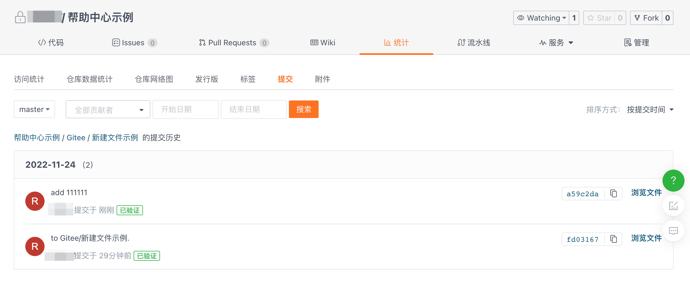
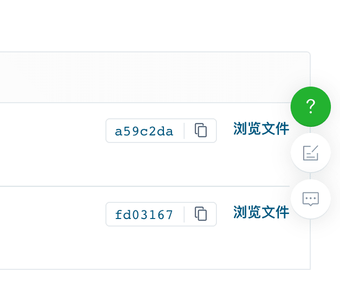

How to view the history versions of a specified file?

Click on the file you want to view the history of, click on the 'History' feature, and you can view the history versions of the file.

## View the history files of past submissions

On the file history page, you can find the version number for each commit history. Click the 'Browse Files' feature to read the content of that historical version.

