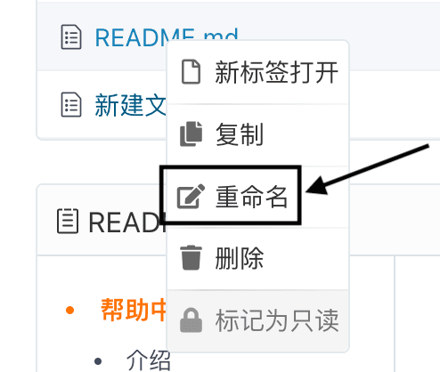

## Renaming files online

Select the file or folder to be modified, right-click, and then select the `Rename` function.

## Move file (modify file path)

Click into the file you want to move, find the 'Edit' function, enter the desired path in the file name field, add the commit message for this modification, and select 'Commit'.

