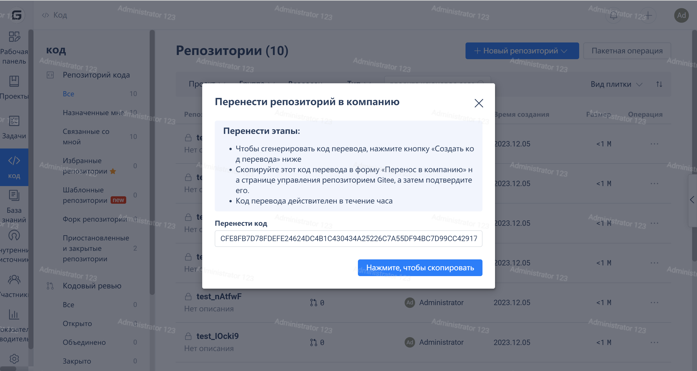

### What is a transfer code

Transfer code is used to transfer project code credentials between Gitee Community Edition and Enterprise Edition. The transfer code is valid within one hour after it is generated.

### Acquisition method

> In the Gitee Enterprise backend -> "Repositories" -> "Add Repository" -> "Transfer Repository", select "Generate Transfer Code" to obtain it.

