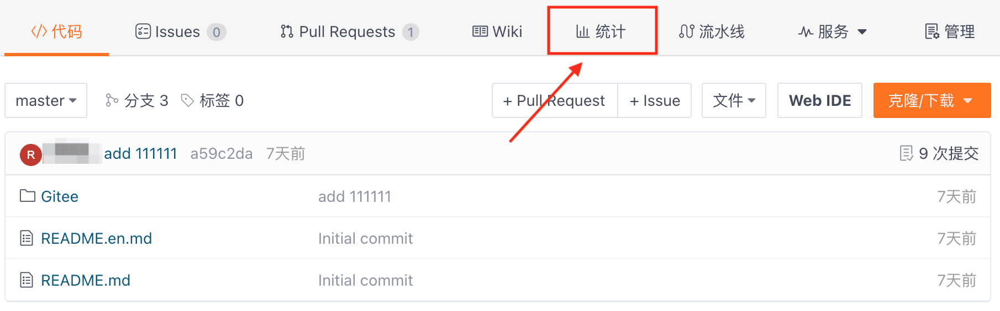
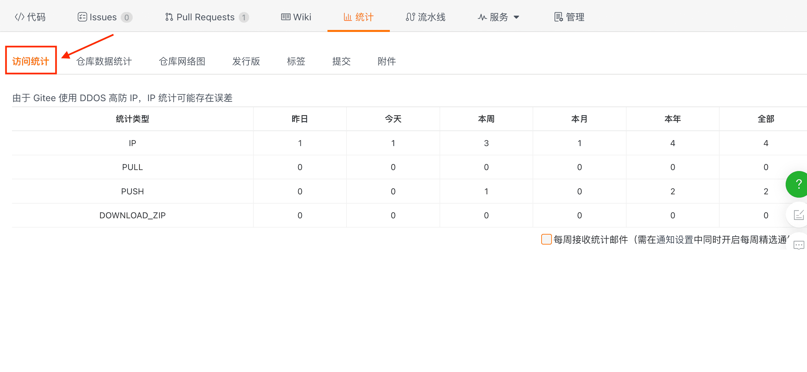
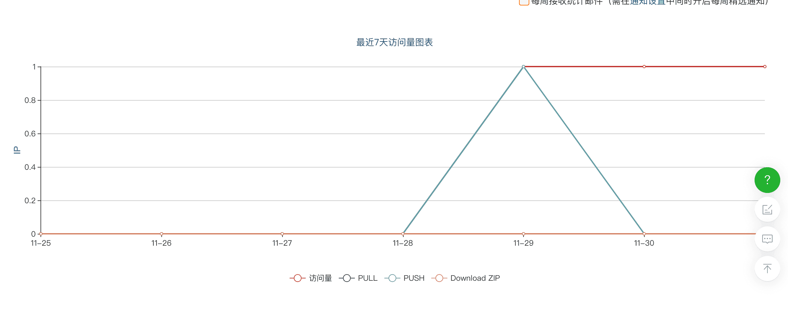

## How to Determine the Repository's Access Count?

After entering the repository, click the "Statistics" button on the repository's main page to enter the statistics page. Click the "Access Statistics" button to obtain the access statistics for this repository. Gitee will visualize the repository's access statistics data in both table and chart forms. You can also select the option to receive weekly statistical emails on this page.

