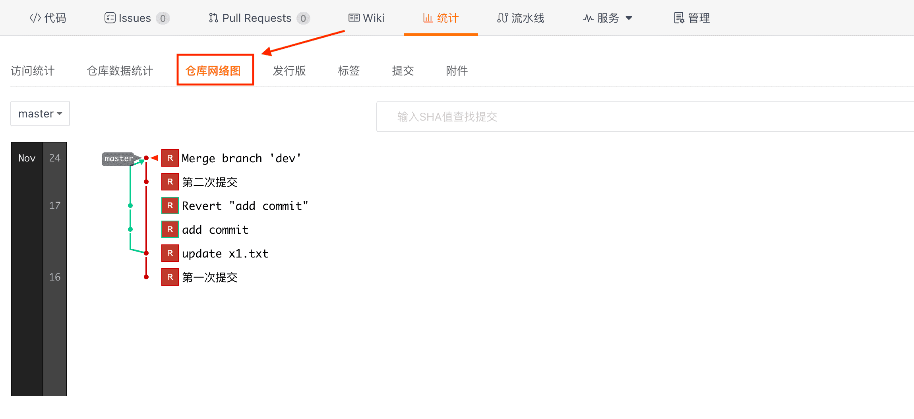

## Просмотр сетевого графика репозитория

После входа в репозиторий нажмите кнопку "Статистика" на главной странице репозитория, чтобы перейти на страницу статистики. Нажмите на кнопку 'Сетевой график репозитория'. Сетевой график показывает историю ветвей всей сети репозитория, включая ветви корневого репозитория и ветви форкнутых репозиториев, содержащие уникальные коммиты.

Вы можете использовать это изображение, чтобы лучше понять, кто использует репозиторий, почему они его используют и какие изменения были сделаны.