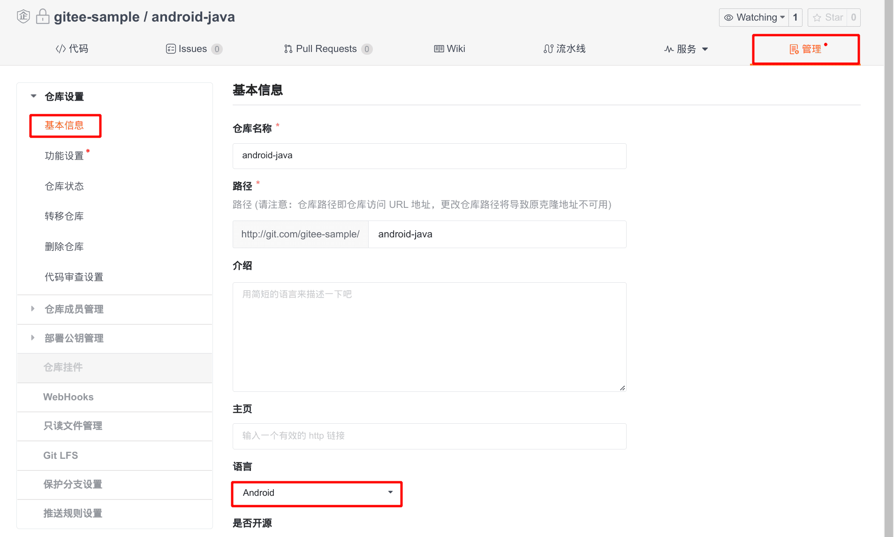
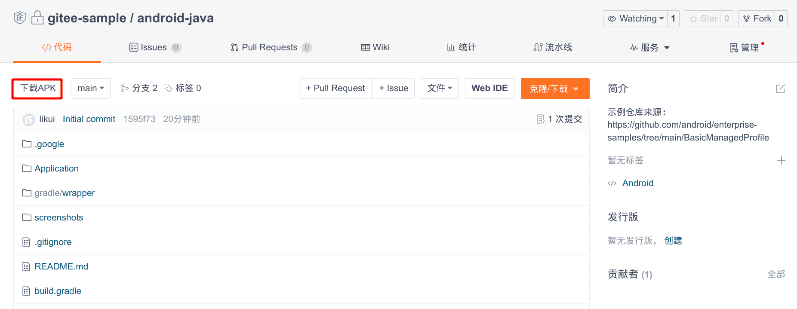
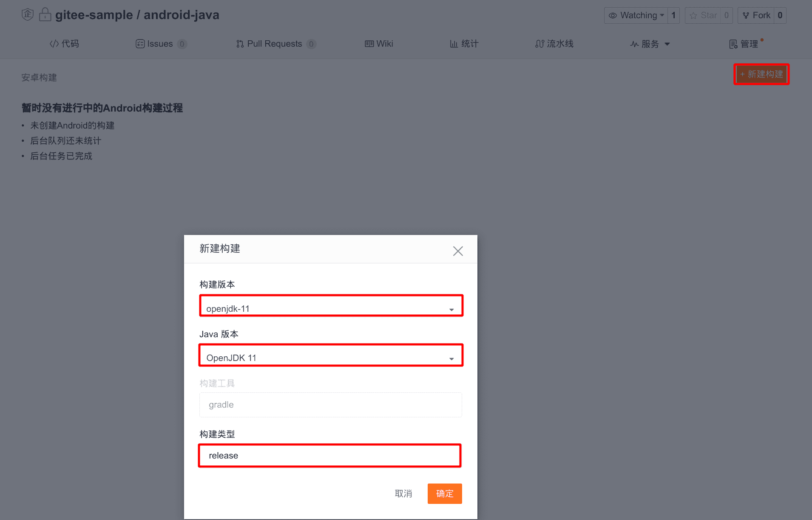
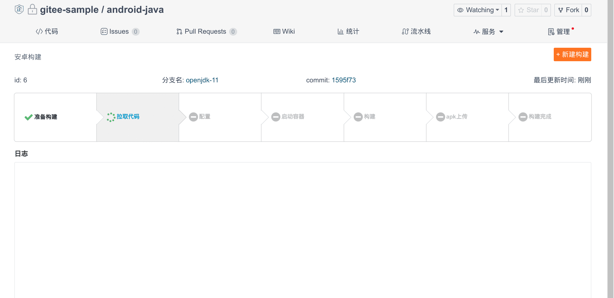
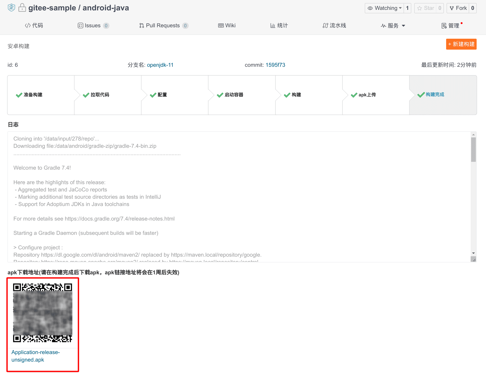

Среда сборки Android

- Ubuntu 20.04
- Android NDK r19c
- Gradle 6.9.1 (используется в случаях, когда версия не указана)
- Kotlin версия 1.3.31
- OpenJDK версия 8/11/17, по умолчанию 8

# Шаги использования

1. Управление -> Основная информация -> Язык: `Android`:
    
2. Домашняя страница репозитория -> Скачать APK:
    
3. Создайте сборку, выберите версию сборки, версию Java и заполните тип сборки:
    
4. Процесс сборки:
    
5. Сборка завершена:
    

## Пример сборки проекта Android

Используем в качестве примера [gitee-sample/android-kotlin](https://gitee.ru/gitee-sample/android-kotlin/tree/openjdk-11).

### Структура каталогов

Рекомендуется стандартная структура каталогов проектов Android, например:

```text
.
├── app
│   ├── build.gradle
│   └── src
├── build.gradle
├── gradle
│   └── wrapper
│       ├── gradle-wrapper.jar
│ └── gradle-wrapper.properties  # Optional
├── gradle.properties
├── gradlew                            # Required
├── gradlew.bat
└── settings.gradle
```

- Если файл «gradle/wrapper/gradle-wrapper.properties» существует, Gitee прочитает и изменит его.
* `gradlew` требуется и должен иметь разрешения на выполнение, он будет выполнен во время сборки.

### Процесс сборки:

1. Удостоверьтесь в том, что проект является стандартным проектом Gradle.
2. В целях ускорения загрузки градиента измените свойство distributionUrl в файле gradle/wrapper/gradle-wrapper.properties, например:

    ```diff
    -distributionUrl=https\://services.gradle.org/distributions/gradle-7.3.3-bin.zip
    +distributionUrl=file:///data/android/gradle-zip/gradle-7.3.3-bin.zip
    ```

1. (Дополнительно) Обработка настройки подписи
2. Выполните команду 'gradlew'. Для ускорения процесса сборки будет использовано внутреннее зеркало Maven 'maven.local' на Gitee.
3. (Дополнительно) Подписание
4. После успешной сборки загрузите apk-файл. Будет загружен любой только что созданный в директории файл `*.apk`.

## О подписях

> Системы Android требуют, чтобы все APK-файлы были подписаны сертификатом, прежде чем их можно будет установить на устройство или обновить.

Чтобы защитить ключ подписи приложения и хранилище ключей, не рекомендуется помещать соответствующую информацию в репозиторий Git. Однако отсутствие соответствующего контента приведет к ошибкам в упаковке APK, или сгенерированный файл APK не сможет быть напрямую установлен в системе Android. Чтобы решить эту проблему, Gitee предоставляет дополнительную функцию: сохранение конфигурации подписи.

### Выберите «Сохранить настройки подписи».

Gitee не будет изменять файл настроек.

Если в файле настроек есть элементы настроек, связанные с подписями, но доступ к связанным с подписями файлам недоступен, сборка завершится неудачно.

### Снимите флажок «Сохранить настройки подписи»

Если параметр «Сохранить настройки подписи» **не** выбран, Gitee выполнит следующие операции:

1. Удалит связанные с подписью настройки в файле build.gradle, представленном сценарием оболочки, при помощи следующего скрипта:

```bash
readarray -d '' bfs < <(find apk-repo/ -type f -name "build.gradle" -print0)
for bf in ${bfs[@]}
do
sed -i \
    -e "/keyAlias\s/d" \
    -e "/keyPassword\s/d" \
    -e "/storeFile\s/d" \
    -e "/storePassword\s/d" \
    -e "/signingConfig\ssigningConfigs/d" \
    ${bf}
done
```

2. Создаст случайное хранилище ключей с помощью командного инструмента keytool.
3. Подпишет файл apk с помощью инструмента командной строки apksigner.