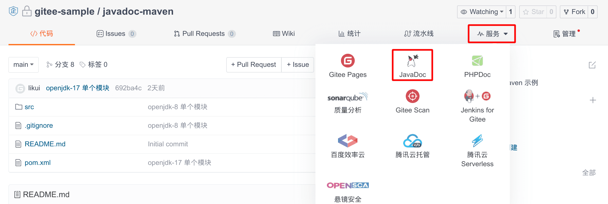
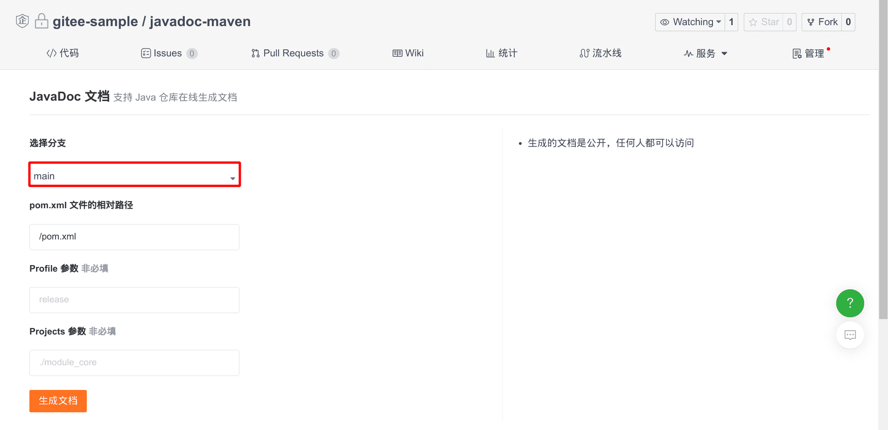
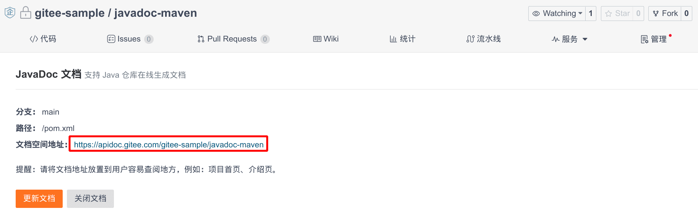

Gitee supports automatic generation and hosting (free) of JavaDoc documentation.

## Environment

* Apache Maven 3
* OpenJDK 8/11/17

Only supports Maven repository.

## Steps to Use

### Step 1

On the Gitee (gitee.ru) repository homepage, click "Services" - select "JavaDoc".

### Step 2

Fill in the relevant parameters according to the prompt information and click 'Generate Documentation'.

### Step 3

Click the document access address link to view the document.

