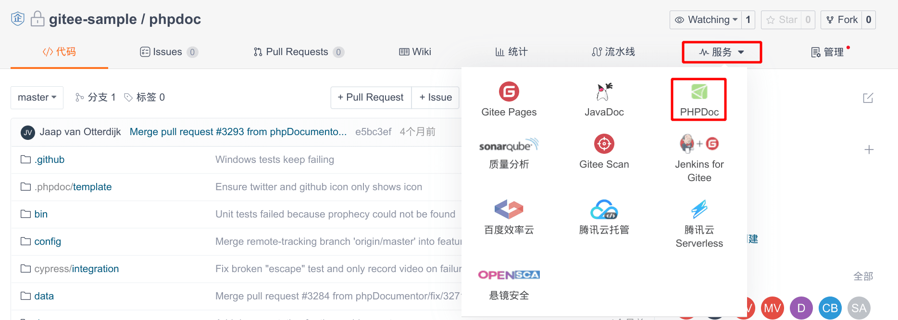
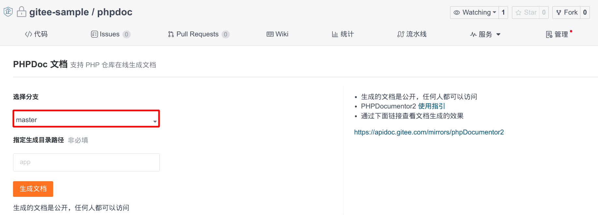
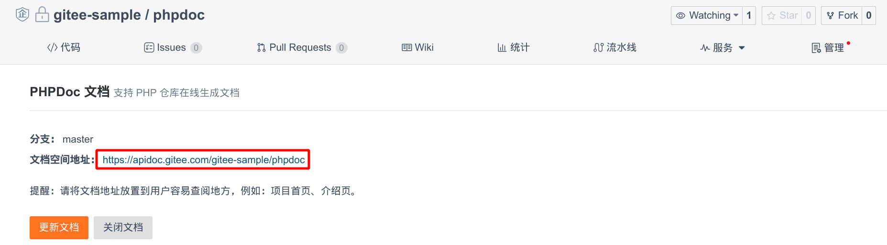

Gitee supports automatic generation and hosting service (free) for PHP project documentation.

## Environment

* phpdoc 3.3

## Steps

### Step 1

On the Gitee (gitee.ru) repository homepage, click "Services" - select "PHPDoc".

### Step 2

Fill in the relevant parameters according to the prompt information and click 'Generate Documentation'.

### Step 3

Click the document access address link to view the document.

