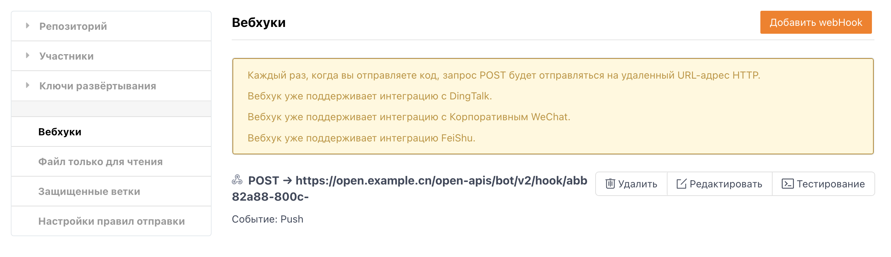

Users can add WebHooks through **"Repository homepage"->"Management page"->"WebHooks"**

### Parameter Description

URL(*): The http address that receives WebHook data. Gitee will send a Post request to this address.

- Password: To ensure security and identify the source of data, it is recommended to set a password. Gitee will carry this password in the Post data. Note that the password is in plain text.

- Hook: WebHooks that can be triggered by users on Gitee, supports adding multiple hooks

### Hook Types

Currently, Gitee supports the following 5 hooks:

- Push: Push code to repository, push/delete branches

- Tag Push: Create / Delete tag

- Issue: Create a task, change task status, change task assignee

- Pull Request: Create, update PR code, merge Pull Requests

- Comment: Comment on repository, task, Pull Request, Commit

### Test WebHook

After adding a WebHook, you can test if the WebHook is working properly. Gitee will send test data to the specified URL.

