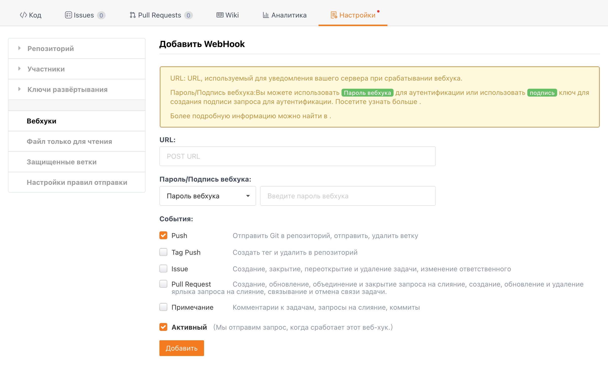

Feishu предоставляет функцию "Групповой робот" во внутренних групповых чатах. С помощью вебхуков вы можете добавить пользовательских роботов в Feishu для автоматических уведомлений.

## Добавление робота

С правой стороны в групповом чате Feishu `Настройки` -> `Групповой робот` -> `Добавить робота`, выберите `Пользовательский робот`, установите аватар и имя для робота, нажмите `Добавить`

> В настоящее время групповые чаты, содержащие внешние контакты, не поддерживают добавление роботов.

Настройка вебхука робота

При добавлении вебхука на предыдущем шаге вы получите URL-адрес запроса вебхука, например, https://open.feishu.cn/open-apis/bot/hook/xxxxxxxxxxxxxxxxxxxxxxxxxxxxxxxx. Добавьте этот URL-адрес в Gitee, чтобы завершить настройку вебхука.

На странице репозитория в Gitee перейдите в "Управление" -> "Настройки вебхуков" -> "Добавить", чтобы добавить новый вебхук.

Заполните полученный URL-адрес вебхука в поле URL, выберите конкретное событие-триггер, активируйте и добавьте, чтобы завершить настройку вебхука.

## Триггеры вебхуков

Cледующие сценарии активируют запросы вебхука к Feishu.

- Push: Репозиторий отправляет код, создает ветки, удаляет ветки
- Tag Push: Создание тега, удаление тега
- Issue: Создание, закрытие, повторное открытие, удаление задач или изменение назначенных исполнителей задачи
- Pull Request: Создание запроса на слияние, обновление запроса на слияние, объединение запроса на слияние
- Comment: Комментарии к репозиториям, задачам, запросам на слияние, коммитам

## Связанные материалы

- [Поддержка Gitee вебхуков для робота группового чата DingTalk](/help/articles/4135)
- [Поддержка Gitee вебхуков для WeChat Work](/help/articles/4296)