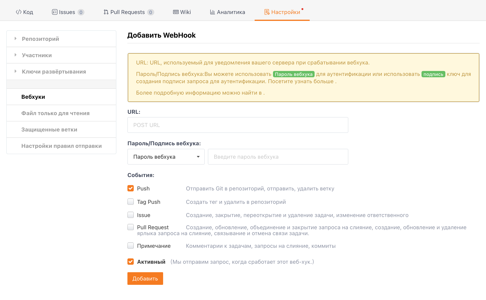

Вебхуки Gitee поддерживают уведомления через робота Slack.

## Добавить робота

1. Перейдите на https://api.slack.com/apps, выберите "Создать новое приложение" и выберите соответствующее рабочее пространство Slack для создания приложения Slack.
2. После создания выберите канал в качестве канала общения для отправки уведомлений через `Функции`->`Входящие вебхуки`->`Добавить новый вебхук в рабочее пространство`, и авторизуйте группу для получения адреса вебхука.

Настройка вебхука робота

При добавлении вебхука на предыдущем шаге вы получите URL-адрес запроса вебхука, например, `https://hooks.slack.com/services/xxxxxxxx/xxxxxxxx/xxxxxxxx`. Добавьте этот URL-адрес в Gitee, чтобы завершить настройку вебхука.

Для добавления нового вебхука на странице репозитория в Gitee перейдите в "Управление" -> "Настройки вебхуков" -> "Добавить".

Для завершения настройки вебхука заполните полученный URL-адрес вебхука в поле URL, затем выберите, активируйте и добавьте конкретное событие-триггер.

## Триггеры вебхуков

Следующие сценарии активируют запросы вебхука к Slack.

- Push: Репозиторий отправляет код, создает ветки, удаляет ветки
- Tag Push: Создание тега, удаление тега
- Issue: Создание, закрытие, повторное открытие, удаление задач или изменение назначенных исполнителей задачи
- Pull Request: Создание запроса на слияние, обновление запроса на слияние, объединение запроса на слияние
- Comment: Комментарии к репозиториям, задачам, запросам на слияние, коммитам

## Связанные материалы

- [Поддержка Gitee вебхуков для робота группового чата DingTalk](/help/articles/4135)
- [Поддержка Gitee вебхуков для WeChat Work](/help/articles/4296)