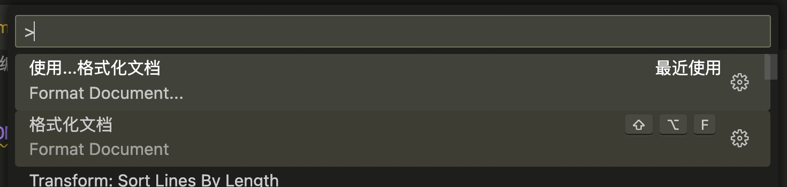
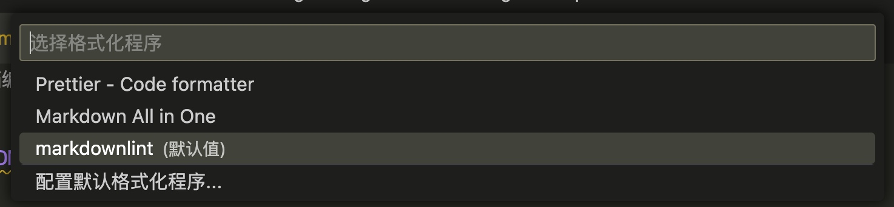

# Markdown Document Writing Guidelines

This is the **Markdown Writing Specification** followed and agreed upon by the team, aiming to enhance the readability of documents.

> The keywords used in the document `MUST` / `MUST NOT` / `REQUIRED` / `SHALL` / `SHALL
NOT / SHOULD / SHOULD NOT / RECOMMENDED / MAY and OPTIONAL are explained in [RFC2119](http://oss.org.cn/man/develop/rfc/RFC2119.txt).

## 1. Typesetting Guidelines (Key References)

Neat formatting is very important for an article, please pay attention to the following:

- Capitalize the first letter of proper nouns in English
- Spaces **MUST** be kept between English characters to avoid sticking together with Chinese characters
- Chinese **must** use full-width punctuation marks
- **MUST** strictly follow the Markdown syntax
- "`highlight`", "**bold**", and "[link]()" all need to have a space on both sides
- Please use code comments extensively in longer code sections.
- Refer to the following content for typesetting in Chinese and English

## 2. Document and Chapter Naming

- `MUST` suffix must use `.md` or `.mdx`
- `MUST` File names (including articles and referenced images) must be in lowercase, and multiple words should be separated by `-`
- `MUST` file encoding must be UTF-8
Document titles SHOULD be represented in the document's meta information instead of using `#`, as shown below:

    ```markdown
    ---
title: Markdown Writing Guidelines
    ---
    ```

- `SHOULD` The document should have a sentence describing the core content of the document. And it should be indicated in the `description` field of the document's `meta` information.

    ```markdown
    ---
title: Markdown Writing Guidelines
    description: Introduction to the overall document writing guidelines
    ---
    ```

Documents SHOULD have a complete and independent globally unique URL (Slug) to ensure the global uniqueness of the document.
  - `SHOULD` `Slug` names must be in lowercase English or alphanumeric combinations, and multiple words should be separated by `-`
  - `SHOULD` `Slug` must be represented in the `slug` field of the document's `meta` metadata

        ```markdown
        ---
        title: Markdown Writing Guidelines
        description: Overall introduction to the writing guidelines
        slug: /markdown-guidelines
        ---
        ```

- `MUST` Chapter titles must start with `##`, not `#`
- `MUST` The chapter title must have a space after `#`, and there should be no `#` after it

    ```makrndown
    // bad
## Chapter 1

    // bad
## Chapter 1 ##

    // good
## Chapter 1
    ```

- `MUST` There must be a blank line between section titles and content

    ```makrndown
    // bad
## Chapter 1
    Content
## Chapter 2
    
    // good
## Chapter 1
    
    Content
    
## Chapter 2
    ```

## 3. Content Writing Guidelines

- `MUST` Code blocks must use the Fenced code blocks style. When using `  ` to represent a multi-line code, it is required to clearly indicate its language, as shown below:

    ```makrndown
    ```{language}
    ```

`SHOULD` The format of the table should refer to [GFM](https://help.github.com/articles/github-flavored-markdown) as follows:

    ```makrndown
    First Header  | Second Header
    ------------- | -------------
    Content Cell  | Content Cell
    Content Cell  | Content Cell
    
    | Left-Aligned  | Center Aligned  | Right Aligned |
    | :------------ |:---------------:| -----:|
    | col 3 is      | some wordy text | $1600 |
    | col 2 is      | centered        |   $12 |
    | zebra stripes | are neat        |    $1 |
    ```

- `SHOULD` Use the following rules for mixing Chinese and English:
- English and numbers should use half-width characters.
  - No spaces between Chinese characters
  - Add spaces between Chinese characters and English, Arabic numerals, @ # $ % ^ & - . ( ) and other symbols
- No space is added between Chinese punctuation marks.
  - There should be no space between Chinese punctuation marks and the preceding/following characters (regardless of full-width or half-width)
- If there are Chinese characters inside parentheses, use Chinese parentheses.
  - Use half-width English parentheses if the content in the parentheses is all in English.
  - When the half-width symbol / represents "or", no spaces are added between the preceding and following characters
  - Other specific examples are recommended to be read [here](https://github.com/sparanoid/chinese-copywriting-guidelines)
- `SHOULD` Chinese symbols should be written as follows:
  - Use straight quotation marks (「」) instead of double quotation marks (""), please refer to [here](http://www.zhihu.com/question/19755746) for specific settings in different input methods.
  - Use "……" for ellipsis, and "。。。" only for pauses
  - Other references can be found at [Zhihu Specification](http://www.zhihu.com/question/20414919)

## 4. Ways of Expressing Content

Article content description should follow "The Element of Style" (`SHOULD`):

- Make paragraphs the unit of the article: Each paragraph should express only one main idea
- Usually, the main point should be stated at the beginning of each paragraph, and the point should be summarized at the end of the paragraph
- Use active voice
- Use affirmative statements in declarative sentences
- Remove unnecessary words
- Avoid using loose sentences consecutively
- Express parallel meanings using the same structure.
- Group related words together
- In the summary, use the same tense (referring to tense in English, not applicable in Chinese, so can be ignored)
- Put emphasis words at the end of the sentence

## 5. Writing and Recommended Tools

It is recommended to use professional Markdown editors or text editors such as `VSCode` and `MWeb` to write documents, which can help you effectively solve the problem of document writing specifications.

### 5.1 Visual Studio Code

#### 5.1.1 Use `markdownlint` as default to format the document

Use `Crtl`/`Command`+`Shift`+`P` to bring up the command panel, type `>format document`, and select "Format Document with..." to configure.





#### 5.1.2 Enable auto formatting on save

It is recommended to enable the automatic formatting feature of VSCode by default to ensure that the document is not forgotten to be checked for formatting before submission. The method to enable it is as follows:

Use `Ctrl`/`Command`+`Shift`+`P` to bring up the command palette, and then input `toggle formatting` to switch the formatting.

### 5.2 AutoCorrect for Visual Studio Code

"[AutoCorrect for Visual Studio Code](https://marketplace.visualstudio.com/items?itemName=huacnlee.autocorrect) is used for "automatic correction" or "checking and suggesting" text, providing correct spacing for CJK (Chinese, Japanese, Korean) and English mixed writing, and attempting to automatically correct punctuation in a safe manner."